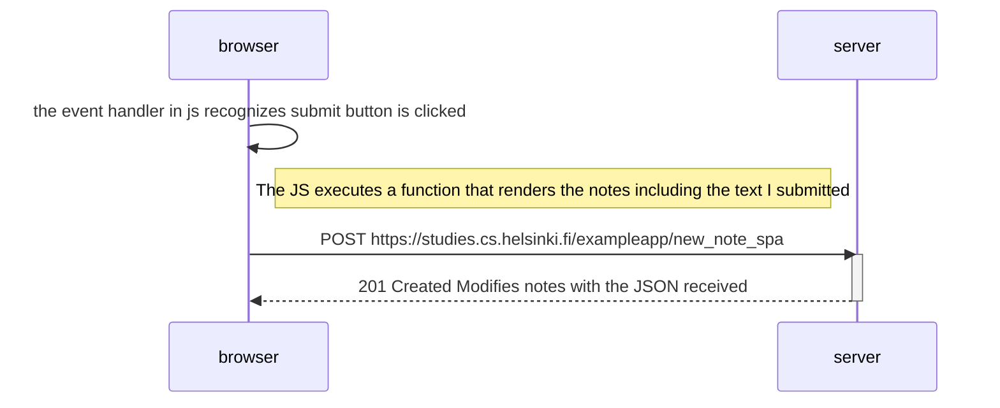

```mermaid
sequenceDiagram
    participant browser
    participant server

    browser->>browser: the event handler in js recognizes submit button is clicked
    Note right of browser: The JS executes a function that renders the notes including the text I submitted

    browser->>server: POST https://studies.cs.helsinki.fi/exampleapp/new_note_spa
    activate server
    server-->>browser: 201 Created Modifies notes with the JSON received
    deactivate server

```